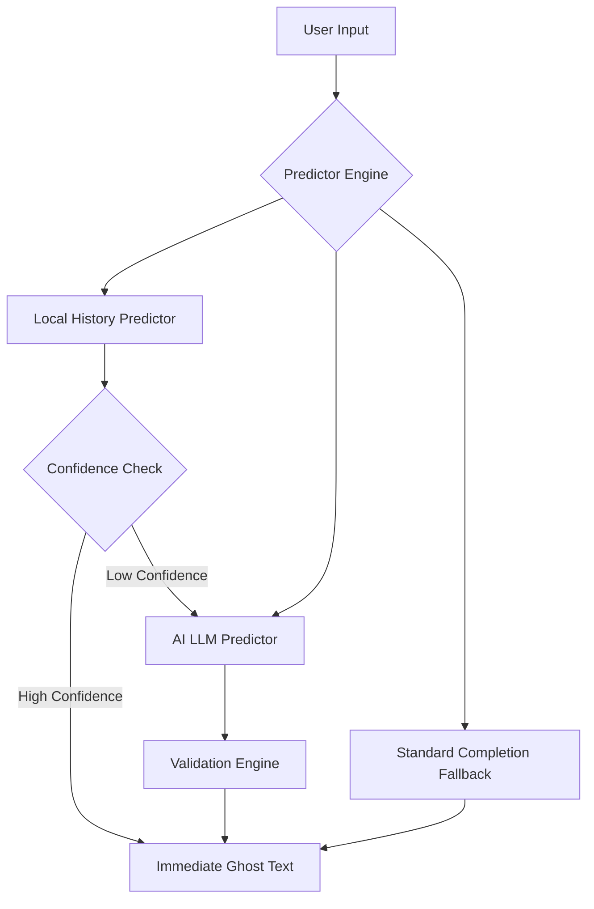

# Terminal Command Prediction System (Warp-style)

This document outlines the architecture and logic for the intelligent command prediction system (Ghost Text / Inline Completions) as implemented in high-end terminals like Warp.

## 1. High-Level Architecture

The system follows a **Hybrid Predictive Approach**, combining local deterministic data with remote probabilistic models (LLMs).



## 2. Prediction Strategies

### A. Local History Predictor (Low Latency)
- **Contextual Matching**: Instead of just matching prefixes, it looks at the *sequence* of commands.
- **Similar Context**: If the user just ran `git add`, the system searches the SQLite history for what usually follows `git add` in the current directory or session.
- **Heuristic**: If a command has been run at least $N$ times in a similar context and represents $>X\%$ of the occurrences, it is returned immediately without calling the AI (Zero Latency).

### B. AI LLM Predictor (Intelligent)
When local history is insufficient, a request is sent to an LLM with the following context:
- **Last $N$ blocks**: The commands and their exit codes.
- **Working Directory**: The files currently present in the folder (via `ls` or similar).
- **Environment Variables**: Key variables that might affect command behavior.
- **Prefix**: The current string the user has already typed.

### C. Standard Completion Fallback
- Uses shell-specific completion specs (zsh, fish, bash).
- Useful for completing flags (e.g., `--help`) or file paths.

## 3. The Prediction Lifecycle

### Phase 1: Zero-State Prediction (Proactive)
As soon as a command finishes executing (Exit Code received):
1. The system **proactively** calculates the most likely next command.
2. It caches this result.
3. When the user focuses the input, the ghost text is already waiting.

### Phase 2: Prefix Matching (Reactive)
As the user types (e.g., "dock"):
1. The system filters the cached predictions or history entries by prefix.
2. It triggers a debounced request to the AI if no high-confidence local match is found.

## 4. Validation Engine (Critical)
To prevent "hallucinations" or suggesting deleted files, the system runs a background validation:
- **Path Validation**: If a prediction contains a file path, check if `std::path::Path::exists()`.
- **Command Parsing**: Parse the suggested command using completion specs. If it fails to parse (e.g., invalid flags), discard or deprioritize.
- **Timeout**: Validation must be fast (<150ms) or it is bypassed to maintain UI responsiveness.

## 5. Deep Dive: AI Context Construction

When a request is sent to the LLM, it contains more than just the current prefix. The `GenerateAIInputSuggestionsRequest` includes:

### A. Context Messages (Terminal Transcript)
The system extracts the last **5 command blocks**. Each block includes:
- **Input**: The command that was run.
- **Output**: A truncated summary of the terminal output (e.g., first 100 lines and last 200 lines). This helps the AI understand if the previous command failed or what files it produced.
- **Metadata**: Exit code, current working directory (PWD), and the active Git branch.

### B. History Context (Semantic Patterns)
This is a unique feature. Warp sends "snippets" from your history where similar sequences occurred:
- It finds past occurrences of the last command you ran.
- It includes the command that followed it in those past sessions.
- This provides the LLM with "few-shot" examples of your specific workflow patterns.

### C. System Context
Includes environment details:
- **OS**: macOS/Linux version.
- **Shell**: zsh/bash/fish version.
- **Environment Variables**: Key variables (like `PATH`, `EDITOR`) that influence command choices.

## 6. Implementation Roadmap for Launcher

To adapt this to your service, follow these steps:

1. **Local Database**: Create a SQLite schema to store `(id, command, exit_code, pwd, git_branch, output_summary, timestamp)`.
2. **Context Gatherer**: Implement a background worker that serializes the last 5 blocks into JSON objects.
3. **Ghost Text UI**: 
   - Use a transparent textarea on top of your main input.
   - Sync font properties (family, size, line-height) exactly.
   - Render the suffix (Prediction minus Prefix) in a muted color (e.g., `rgba(255, 255, 255, 0.3)`).
4. **Debounced API Client**: 
   - Wait ~50-100ms after the last keystroke before calling the LLM.
   - Use an `AbortController` (or `AbortHandle` in Rust) to cancel pending requests if the user types again.
5. **Validation Hook**: 
   - Before showing a ghost text, do a quick `stat` or `ls` check if it looks like a file/directory path.

## 7. Data Contracts (API)

To replicate the AI part, your service must implement these JSON structures:

### Request Schema
```json
{
  "prefix": "dock",
  "context_messages": [...],
  "history_context": "{\"command\":\"ls\",\"exit_code\":0}\n...",
  "rejected_suggestions": ["docker run"],
  "system_context": "{\"os\":\"macos\",\"shell\":\"zsh\"}"
}
```

### Response Schema
```json
{
  "commands": ["docker ps", "docker images"],
  "ai_queries": [],
  "most_likely_action": "docker ps"
}
```

## 8. Feedback & Learning Loop

A critical part of the Warp experience is how it handles user interaction with suggestions:

- **Acceptance**: Triggered by `Tab` or `Right Arrow`. This should be logged to telemetry to reinforce the model's success rate.
- **Cycling**: If the user presses `Down Arrow` while a ghost text is visible, the system cycles through the other items in the `commands` array from the response.
- **Rejection/Ignoring**: If the user continues typing something different, the current suggestion is added to `rejected_suggestions` for the next API call (to avoid annoying the user with the same wrong guess).
- **History Weighting**: Successful AI suggestions are often "promoted" to the local SQLite history, making them even faster (Zero Latency) next time.

---
*Document generated based on Warp's `next_command_model.rs`, `generate_ai_input_suggestions.rs` and `api/response.rs` architecture.*
