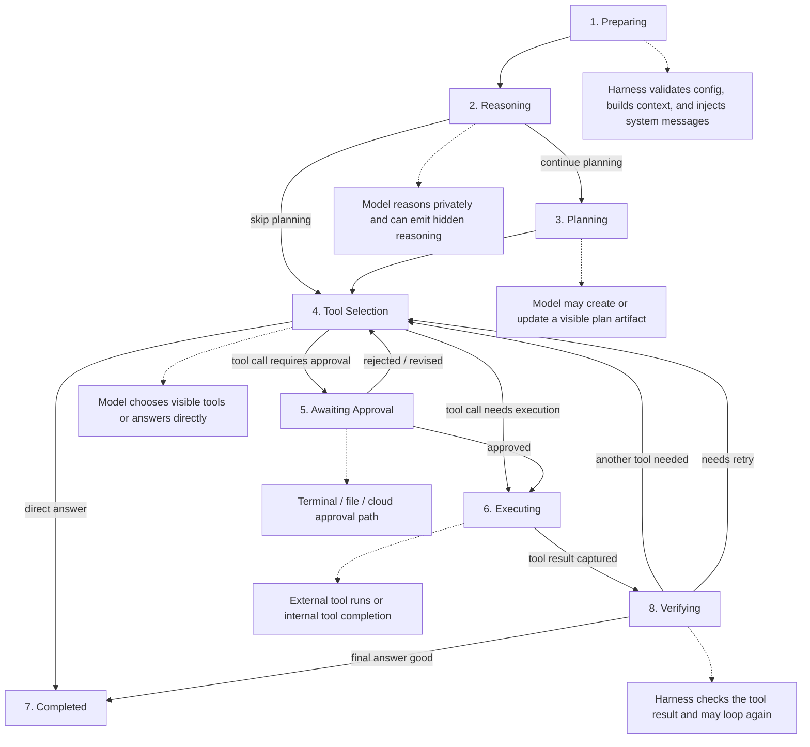

# Agent Harness Loop

This document shows the current Octomus agent loop as implemented by the harness/runtime pair.
The diagram below is a conceptual view of the loop. The compatible harness currently compresses several of these stages into a single streaming model pass.


## High-Level Flow

```text
Preparing
   |
   v
Reasoning
   |-----------------------> Planning -----------------------> Tool Selection
   |                                                               |
   |                                                               +--> Awaiting Approval --> Executing --> Verifying
   |                                                                                          ^               |
   |                                                                                          |               |
   |                                                                                          +---------------+
   |
   +--> Tool Selection
   |
   +--> Completed
```



## Stage Details

### 1. Preparing
1. Validate API key, model config, and cancellation state.
2. Build the message bundle for the run.
3. Inject system prompts, skills, workspace context, and recent conversation history.
4. Move the runtime to `reasoning`.

### 2. Reasoning
1. Send the prepared bundle to the provider.
2. Stream private reasoning tokens to the reasoning channel.
3. Decide whether the task benefits from a visible plan.
4. Either continue to `planning`, skip straight to `tool-selection`, or finish with a direct answer.

### 3. Planning
1. Create or update a visible plan artifact.
2. Use `propose_plan`, `update_plan`, or `plan_execution` when the task needs a visible execution plan.
3. Publish the plan back into the conversation history.
4. Return control to `tool-selection`.

### 4. Tool Selection
1. Let the model choose a visible action or a final answer.
2. Allowed tools depend on the contract and current stage.
3. Typical choices include:
   - `lookup_web`
   - `explore_workspace`
   - `read_workspace_file`
   - `propose_file_change`
   - `propose_terminal_command`
   - `launch_cloud_agent`
   - `suggest_follow_up`
4. The harness parses one emitted tool call at a time in the current compatible runtime.

### 5. Awaiting Approval
1. Use this path when the selected tool needs user approval.
2. Typical examples:
   - `propose_terminal_command`
   - `propose_file_change`
   - `launch_cloud_agent`
3. Emit the pending tool call to the UI.
4. Wait for the user or UI to approve or reject the action.

### 6. Executing
1. Run the approved external action or dispatch the tool.
2. Capture the resulting output or artifact.
3. Store the pending tool call in runtime state while the action is in flight.
4. Transition toward `verifying` after the result is available.

### 7. Verifying
1. Feed the tool result back into the conversation history.
2. Ask the model whether the result is enough.
3. Let the model either:
   - continue with another tool
   - revise a plan
   - answer the user directly
4. Return to `tool-selection` when more work is needed.

### 8. Completed
1. Emit the final visible answer.
2. Clear pending tool state.
3. Mark the run as finished in the runtime.

## Notes On Parallel Cloud Sessions

1. The cloud runtime can keep multiple sessions alive at once because sessions are tracked by `session_id`.
2. That means the app can have several cloud runs in parallel if they are launched in separate turns or separate invocations.
3. The current compatible harness still processes one tool call per model response, so true multi-launch batching in a single turn would require a protocol change.
4. Even without that batching, the loop can relaunch or repeat a cloud launch on later passes, which is enough to create multiple active cloud sessions over time.

## Why This Loop Exists

1. Keep visible artifacts separate from hidden reasoning.
2. Preserve approval boundaries for risky actions.
3. Allow the model to retry or refine an action without losing the conversation state.
4. Support long-running cloud work without blocking the local run.
