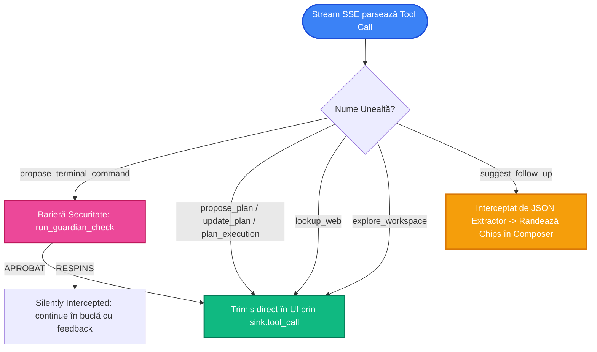

# Ciclul de Viață al Instrumentelor (Tools Lifecycle) în Octomus

Acest document descrie în detaliu modul în care instrumentele (uneltele/funcțiile) înregistrate sunt procesate, interceptate și executate de către harness-ul Octomus în backend și frontend.

---

## 1. Catalogul Uneltelor Active

Octomus pune la dispoziție 6 unelte de bază, definite structural în [tools.rs](file:///Users/adriantucicovenco/Proiecte/launcher-rs-react/src-tauri/src/ai/agent/openai/tools.rs):

| Nume Unealtă | Scopul Principal | Comportament la Execuție |
| :--- | :--- | :--- |
| `lookup_web` | Căutare pe internet | Trimis către interfață pentru a declanșa sub-agentul de căutare web. |
| `explore_workspace` | Explorare recursivă workspace | Trimis către interfață pentru a declanșa căutări locale și afișarea unui card collapsible. |
| `propose_plan` | Crearea planurilor de lucru | Randează un timeline interactiv cu workstream-uri în UI (Blocks). |
| `update_plan` | Actualizarea planurilor | Re-randează și actualizează pașii din timeline. |
| `plan_execution` | Schimbarea stării unui pas | Marchează pașii ca porniți, finalizați sau eșuați. |
| `propose_terminal_command` | Propunere comenzi în terminal | **Interceptată discret în backend de către Guardian** înainte de a fi trimisă în UI. |
| `suggest_follow_up` | Sugestii de prompt-uri | Interceptată centralizat pentru randarea de chip-uri în Composer, eliminând poluarea chat-ului. |

---

## 2. Diagrama Fluxului de Procesare pentru Fiecare Instrument

Când modelul emite un apel de tip `tool_call` în interiorul stream-ului SSE, harness-ul din [harness.rs](file:///Users/adriantucicovenco/Proiecte/launcher-rs-react/src-tauri/src/ai/agent/openai/harness.rs) decide ruta acestuia în funcție de tipul uneltei:

---

## 3. Mecanismul de Interceptare în Detaliu

### A. Interceptarea de Securitate (`propose_terminal_command`)
Spre deosebire de uneltele standard care ajung direct în frontend pentru a fi afișate, comanda de terminal este pusă pe pauză în [harness.rs](file:///Users/adriantucicovenco/Proiecte/launcher-rs-react/src-tauri/src/ai/agent/openai/harness.rs#L196-L230). 
1. Backend-ul citește argumentele propuse.
2. Încarcă profilul curent pentru a detecta dacă există un model special pentru terminal (`terminal_model_id`).
3. Rulează evaluarea Guardian. Dacă este sigură, apelează `sink.tool_call` pentru a trimite comanda utilizatorului spre aprobare. În caz contrar, asistentul este forțat să își rescrie propunerea în spate (negociere asincronă, max 3 încercări).

### B. Separarea Metadatelor (`suggest_follow_up`)
Pentru a preveni ca textul generat de unelte să murdărească istoricul de mesaje citit de utilizator, sugestiile de follow-up sunt filtrate automat. Parserul le extrage și le transmite către panoul ComposerBar de sub chat, unde sunt afișate ca butoane rapide de acțiune.
